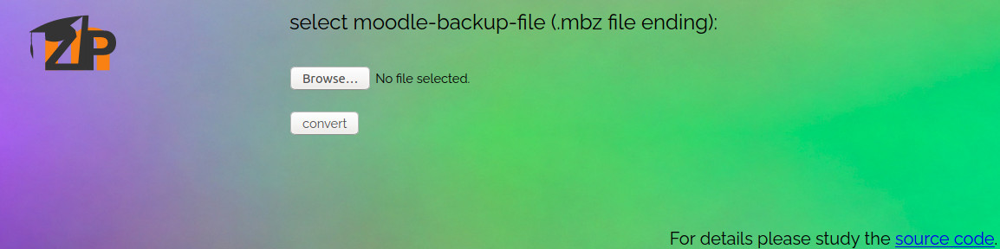

# mbztool

moodle backup files extractor (mbz) - usable as command-line-tool or with a webserver

 

#### Run as python script in command line

##### Anaconda

Install environment:

```bash
./install.sh -i
```

Convert files of mbz-moodle-backup, e.g. `moodlebackup.mbz` into zip file:

```
conda activate mbz
./mbzbot.py -f moodlebackup.mbz
```

##### System python

Install packages:

```
pip install -r requirements.txt
```

Convert:

```bash
./mbzbot.py -f moodlebackup.mbz
```

##### Deploy as system script

```bash
./install.sh -c
```

#### Run as webserver

##### Deploy as docker image

If you want to run mbztool via a docker webserver, you need docker and docker-compose installed. By running the install script, both will be installed. Also the environment and the docker-compose file gets initialized.

```bash
sudo ./install.sh
```

Start the docker image:

```bash
docker-compose up -d
```

##### Syntax

```bash
Usage: ./install.sh -[p|s|b|e|a|c|n|h]

   -p,      Install prerequisites (docker, docker-compose)
   -s,      Setup environment
   -b,      Build docker image
   -e,      Build standalone executable
   -a,      Create anaconda environment
   -c,      Deploy mbzbot.py as system script
   -n,      Generate nginx virtual host
   -h,      Print this help text

If the script will be called without parameters, it will run:
    ./install.sh -p -s -b -n
```

##### Data privacy

By offering this tool as a web-service it is **YOUR RESPONSIBILITY** to check for DSGVO-conformity. Check the source-code and adapt the website to your needs before deploying the web-server publicly. You are welcome to contribute to this projects or report some issues. It is strongly recommended to use the web-server behind an reverse proxy with SSL/TSL encryption (e.g. with `./install.sh -n`).

The web-server has the following features:

* uploaded files are processed with `mbzbot` and converted into a zip format. After this, successful or not, the uploaded file will be deleted.
* the converted zip file will be loaded into memory, deleted from hard-disk and in the end only once offered as download.

#### Credits

Thanks to  https://github.com/Swarthmore/extract-mbz for the inspiration with extracting the mbz files.

#### License
This program is free software: you can redistribute it and/or modify it under the terms of the GNU General Public License as published by the Free Software Foundation, either version 3 of the License, or (at your option) any later version.

This program is distributed in the hope that it will be useful, but WITHOUT ANY WARRANTY; without even the implied warranty of MERCHANTABILITY or FITNESS FOR A PARTICULAR PURPOSE.  See the GNU General Public License for more details.

You should have received a copy of the GNU General Public License along with this program.  If not, see <https://www.gnu.org/licenses/>.